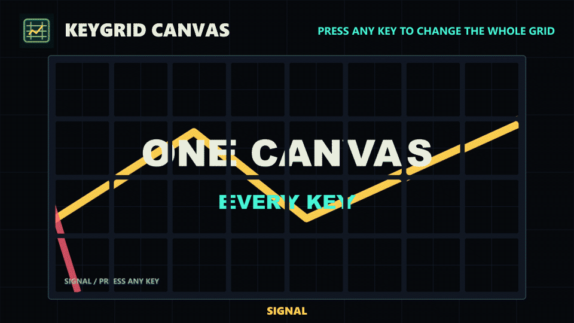

# KeyGrid Canvas

[](https://github.com/nook6e6f6f6b0d0a/keygrid-canvas/actions/workflows/ci.yml)

**Turn every Stream Deck key into one programmable tiled canvas.**

KeyGrid Canvas renders one SVG scene at the full size of your key grid, slices
the scene into per-key images, and presents those images as one coordinated
display. Press any key to cycle through the included gallery scenes.

**[Download the latest KeyGrid Canvas release](https://github.com/nook6e6f6f6b0d0a/keygrid-canvas/releases/latest/download/com.keygrid.canvas.streamDeckPlugin)**



Free and open source. Runs locally with no account, cloud service, telemetry,
shell execution, or companion application.

## Quick start

1. Install Stream Deck 7.1 or newer.
2. Download and double-click `com.keygrid.canvas.streamDeckPlugin`.
3. Add **Canvas Tile** to every key on one page, then press any key to change
   the whole canvas.

## Why this exists

Most Stream Deck plugins treat each key as an independent button. KeyGrid
Canvas treats the whole keypad as a low-resolution display with physical gaps.
The public alpha is deliberately small: a reusable canvas engine, one plugin
action, four scenes, and the tooling needed to build new scenes.

## Included scenes

- **Signal** - one composition and moving tracer across the whole grid.
- **Clock** - a grid-wide clock with bounded dirty-region updates.
- **Spectrum** - animated procedural bars spanning key boundaries.
- **Alignment** - coordinates and diagonals for checking tile placement.

Press any Canvas Tile key to advance to the next scene.

## Supported key grids

| Device | Grid |
| --- | ---: |
| Stream Deck Mini | 3 x 2 |
| Stream Deck / MK.2 | 5 x 3 |
| Stream Deck Neo keys | 4 x 2 |
| Stream Deck Plus keys | 4 x 2 |
| Stream Deck XL | 8 x 4 |
| Other keypad devices | Detected dynamically |

The Plus touch strip and encoders are not part of the canvas in this release.

KeyGrid Canvas supports Windows 10 or newer and macOS 13 or newer. Node.js 24
is needed only when building the plugin from source.

## Create a scene

A renderer receives the virtual canvas size and frame timing, then returns one
SVG frame:

```ts
import type { RenderContext, SceneRenderer, SvgFrame } from "../display/index.js";

export class MyScene implements SceneRenderer {
  readonly id = "my-scene";
  readonly name = "My scene";

  render(context: RenderContext): SvgFrame {
    return {
      kind: "svg",
      width: context.canvas.width,
      height: context.canvas.height,
      background: "#06080c",
      body: `<circle cx="${context.canvas.width / 2}" cy="${context.canvas.height / 2}" r="80" fill="#ffcc4d"/>`
    };
  }
}
```

Renderers may provide `dirtyRects` when only a bounded part of the scene has
changed. The slicer reuses cached tiles outside those rectangles. Without a
dirty hint, it safely compares every generated tile.

## Architecture

```text
SceneRenderer
    |
    v
full-grid SVG frame
    |
    v
SvgTileSlicer -----> cached unchanged tiles
    |
    v
per-key SVG data URLs
    |
    v
StreamDeckButtonPresenter
```

The engine has no network dependency and no knowledge of specific apps,
accounts, games, agents, or local files.

## Build from source

```powershell
pnpm install
pnpm release:check
```

`release:check` type-checks, tests, builds, exports the visual previews,
validates the Stream Deck manifest, and packages the plugin.

## Preview without hardware

```powershell
pnpm build
pnpm preview
```

Open the generated HTML files under `docs/assets/` to inspect the physical-key
layout. The SVG files show the same scene without key gaps.

## Privacy and boundaries

- SVG scenes only in the first alpha.
- One action must be placed on every participating key.
- Physical key gaps remain visible by design.
- Animation throughput varies by device size and Stream Deck software.
- No telemetry, cloud service, shell execution, or external application control.

## Contributing

See [CONTRIBUTING.md](CONTRIBUTING.md). Small renderer examples, device fixes,
tests, and performance improvements are especially welcome.

Have an idea for the grid? [Propose a scene](https://github.com/nook6e6f6f6b0d0a/keygrid-canvas/issues/new?template=scene-proposal.yml)
or pick up an existing issue. Visual contributions should include a screenshot
or generated preview.

## License and trademarks

MIT. Bundled dependency licenses are listed in
[THIRD_PARTY_NOTICES.md](com.keygrid.canvas.sdPlugin/THIRD_PARTY_NOTICES.md).
KeyGrid Canvas is an independent open-source project and is not affiliated
with or endorsed by Elgato or Corsair. Stream Deck is a trademark of its
respective owner.
